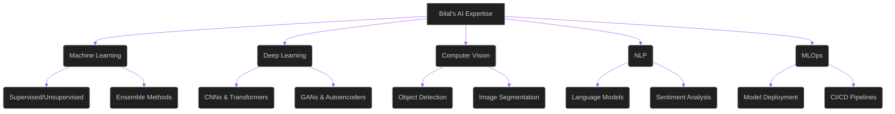

<h1>HI! I'm Bilal</h1>

<!-- Professional Tagline -->
<h2>AI & Machine Learning Innovator | Crafting Intelligent Solutions</h2>

<!-- Profile Stats -->

  
  
  

---

### 👨‍💻 About Me

Well, Hi again, I’m **Bilal Rukundi**, a passionate AI & Machine Learning student dedicated to transforming data into intelligent, impactful solutions. With a strong foundation in mathematics, statistics, and cutting-edge ML frameworks, I specialize in deep learning, computer vision, and natural language processing (NLP). My mission is to bridge theoretical AI research with real-world applications, creating scalable and innovative systems that solve meaningful problems.

🔑 **What Drives Me:**
- Exploring advanced deep learning architectures and transformer models
- Building production-ready ML pipelines with modern MLOps practices
- Staying at the forefront of AI trends through continuous learning
- Writing clean, efficient, and scalable code

📫 **Let’s Connect:** [bilalrukund1658@gmail.com](mailto:bilalrukund1658@gmail.com) | [LinkedIn](https://linkedin.com/in/bilal-rukundi) | [GitHub](https://github.com/Wayn-Git)

---

### 🧠 Expertise

I specialize in creating intelligent systems across the AI/ML spectrum, from research to deployment. My expertise includes:

- **Machine Learning**: Supervised/unsupervised learning, ensemble methods
- **Deep Learning**: CNNs, RNNs, Transformers, GANs
- **Computer Vision**: Object detection, image segmentation, facial recognition
- **NLP**: Sentiment analysis, language models, text generation
- **MLOps**: Model deployment, CI/CD pipelines, cloud platforms

---

### 🛠️ Tech Stack

#### Languages

#### AI/ML Frameworks

#### Data Science & Visualization

#### Web & Application Frameworks

#### DevOps & Tools

---

### 🏆 Featured Projects

**Highlights**:

- **IngressChatBot**: A RAG-powered chatbot that transforms document insights into JSON for interactive visualizations with Streamlit, Matplotlib, and Plotly.
- **MLFromScratch** *(In Progress)*: A repository implementing core ML algorithms and metrics from scratch using only Python, NumPy, and mathematical principles.
- **VoiceEmotionDetector** *(In Progress)*: A machine learning tool to detect emotional states in speech audio, currently in the research and design phase.
- **Urban-Sound-Narrative-Generator** *(In Progress)*: A creative AI project that transforms urban audio into vivid narrative descriptions, acting as a storytelling journalist.
- **CatVsDog Classifier**: A deep learning project that identifies cats and dog.  
*Explore more on [GitHub](https://github.com/Wayn-Git?tab=repositories).*

---

### 📊 GitHub Insights

---

### 🚀 2025 Goals

- Master advanced transformer architectures and LLMs
- Deploy 5+ production-ready ML systems
- Publish technical articles or research papers
- Contribute to impactful open-source AI/ML projects
- Pursue advanced AI certifications

---

### 🌐 Let’s Collaborate

I’m open to exciting opportunities in:
- AI/ML research and novel architectures
- Computer vision and NLP projects
- MLOps and scalable model deployment
- Open-source contributions and hackathons

Reach out via [LinkedIn](https://linkedin.com/in/bilal-rukundi) or [email](mailto:bilalrukund1658@gmail.com).

---

### 💡 Inspiration

> "The best way to predict the future is to invent it." — Alan Kay

**Building intelligent systems, one algorithm at a time.**  
[GitHub](https://github.com/Wayn-Git) | [Portfolio](bilall.is-a.dev)

