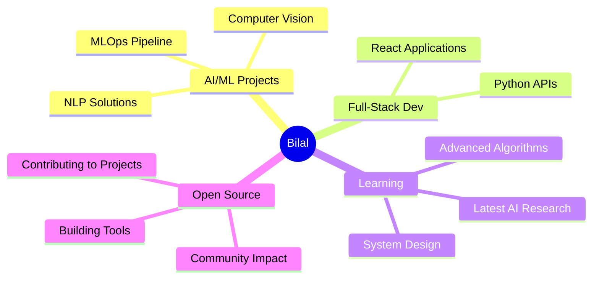

# 

<!-- Clean Header -->
<h1 align="center">👋 Hey there, I'm Bilal </h1>
<h3 align="center">AI & ML Engineer | Python Developer | Data Scientist</h3>
<!--

<!-- Typing Animation -->

<!-- Animated Divider -->

<tr>
<td>

🚀 **AI & ML Engineer** passionate about creating intelligent solutions that make a real impact

🎯 **Currently focusing on:**
- Deep Learning & Neural Networks
- Computer Vision & Image Processing
- Natural Language Processing
- MLOps & Model Deployment
- Full-Stack Development with Python

💡 **What drives me:**
- Solving complex problems with elegant code
- Bridging the gap between research and production
- Contributing to open-source AI/ML projects
- Continuous learning and knowledge sharing

🌱 **Always exploring:** Latest AI research, emerging technologies, and innovative applications of machine learning in real-world scenarios.

</td>

</td>
</tr>

<!-- Animated Divider -->

<!-- Tech Stack with Animated Icons -->

# 🛠️ Tech Arsenal

### 🔥 Languages & Frameworks

  

### 🎨 Design & Tools

  

### 📚 Libraries & Technologies

<!-- Animated Divider -->

## 📈 Contribution Graph

  

<!-- Animated Divider -->

## 🎯 Current Focus

<!-- Project Showcase -->
## 🚀 Featured Projects

<!-- Animated Divider -->

## 🌐 Connect & Collaborate

### Let's build something amazing together! 🤝

### 💡 Open to:
- 🤝 Collaborating on AI/ML projects
- 🚀 Innovative startup opportunities  
- 📚 Knowledge sharing and mentoring
- 💬 Technical discussions and idea exchange

<!-- Fun Section -->
## 🎮 When I'm Not Coding

| 🧠 Learning | 🎨 Creating | 🌱 Growing |
|-------------|-------------|------------|
| Reading AI Research Papers | 3D Modeling in Blender | Contributing to Open Source |
| Exploring New Technologies | Digital Art & Design | Building Side Projects |
| Online Courses & Tutorials | Photography | Networking with Developers |

<!-- Quote Section -->

### 💭 Developer Philosophy

<!-- Visitor Counter -->

---

  <b>⭐ Star my repositories if you find them interesting!</b> 
  <i>Let's connect and build the future together! 🚀</i>

