<div align="center">

<!-- Dynamic Header with Gradient Text -->


<!-- Animated Title -->
[](https://git.io/typing-svg)

<!-- Animated Matrix Background Badge -->


<!-- Profile Views Counter with Style -->
<p align="center">
  
  
  
</p>

</div>

---


### 🚀 About Me

🎓 **AI & ML Student** | Turning data into intelligence, one model at a time

🔭 **Currently Exploring:**
- Advanced Deep Learning Architectures
- Transformer Models & Large Language Models  
- Computer Vision with YOLO, CNNs & GANs
- MLOps, Model Deployment & Optimization
- Reinforcement Learning & Neural Networks

💡 **My Mission:**  
Bridging theoretical AI research with practical, real-world applications that solve meaningful problems.

🎯 **What Sets Me Apart:**
- Strong foundation in mathematics & statistics
- Hands-on experience with cutting-edge ML frameworks
- Passion for clean, efficient, and scalable code
- Active learner staying ahead of AI trends

📫 **Reach me:** bilalrukund1658@gmail.com

<br clear="right"/>

---

## 🧠 AI/ML Expertise Matrix

```mermaid
%%{init: {'theme':'dark', 'themeVariables': { 'primaryColor':'#6366f1', 'primaryTextColor':'#fff', 'primaryBorderColor':'#8b5cf6', 'lineColor':'#a855f7', 'secondaryColor':'#ec4899', 'tertiaryColor':'#14b8a6'}}}%%
mindmap
  root((🤖 Bilal's<br/>AI Arsenal))
    🧮 Machine Learning
      Supervised Learning
        Classification
        Regression
      Unsupervised Learning
        Clustering
        Dimensionality Reduction
      Ensemble Methods
    🕸️ Deep Learning
      CNNs for Vision
      RNNs & LSTMs
      Transformers & Attention
      GANs & Autoencoders
    👁️ Computer Vision
      Object Detection
      Image Segmentation
      Facial Recognition
      Image Generation
    📝 NLP
      Text Classification
      Sentiment Analysis
      Named Entity Recognition
      Language Models
    🔧 MLOps
      Model Deployment
      CI/CD Pipelines
      Monitoring & Logging
      Cloud Platforms
```



---

## 🛠️ Tech Stack & Tools

<div align="center">

### 💻 Programming Languages
<p>
  
  
  
  
  
</p>

### 🤖 AI/ML Frameworks & Libraries
<p>
  
  
  
  
  
  
</p>

### 📊 Data Science & Visualization
<p>
  
  
  
  
  
</p>

### 🌐 Web Development
<p>
  
  
  
  
  
  
</p>

### 🛠️ Tools & Platforms
<p>
  
  
  
  
  
  
</p>

### 🎨 Design Tools
<p>
  
  
  
</p>

</div>


---

## 🏆 Featured Projects

<div align="center">

<a href="https://github.com/Wayn-Git/React_Portfolio_Web">
  
</a>

<a href="https://github.com/Wayn-Git/CatVsDogUI">
  
</a>

</div>

<br/>

<details>
<summary><b>🔍 More Awesome Projects</b></summary>
<br/>

### 🤖 Machine Learning Projects
- **Image Classification Pipeline** - End-to-end ML pipeline with deployment
- **NLP Sentiment Analyzer** - Real-time sentiment analysis system
- **Object Detection System** - Custom YOLO implementation for specific use cases
- **Recommendation Engine** - Collaborative filtering with neural networks

### 💻 Full-Stack Applications  
- **AI-Powered Web Apps** - Integrating ML models with modern web frameworks
- **Data Visualization Dashboards** - Interactive analytics platforms
- **API Development** - RESTful APIs for ML model serving

</details>

---

## 📊 GitHub Analytics

<div align="center">
  
  
</div>

<div align="center">
  
</div>

<div align="center">
  
</div>

---

## 🏅 GitHub Trophies

<div align="center">
  
</div>

---

## 📚 Learning Journey

<div align="center">


</div>

---

## 🌟 Current Learning Focus

<table align="center">
<tr>
<td align="center" width="25%">

<br /><strong>Deep Learning</strong>
<br />Advanced architectures & optimization
</td>
<td align="center" width="25%">

<br /><strong>Computer Vision</strong>
<br />Object detection & segmentation
</td>
<td align="center" width="25%">

<br /><strong>NLP & LLMs</strong>
<br />Transformers & language models
</td>
<td align="center" width="25%">

<br /><strong>MLOps</strong>
<br />Deployment & monitoring
</td>
</tr>
</table>

---

## 💡 What I'm Working On

- 🔬 **Research:** Exploring state-of-the-art AI papers and implementing novel architectures
- 🏗️ **Building:** Full-stack ML applications with modern deployment practices
- 📖 **Learning:** Advanced deep learning techniques and transformer architectures  
- 🤝 **Contributing:** Open-source AI/ML projects and educational content
- 🎯 **Goal:** Mastering the entire ML lifecycle from research to production

---

## 🌐 Connect With Me

<div align="center">

[](https://linkedin.com/in/bilal-rukundi)
[](mailto:bilalrukund1658@gmail.com)
[](https://twitter.com/WaynTweets)
[](https://github.com/Wayn-Git)
[](https://github.com/Wayn-Git/React_Portfolio_Web)

</div>

---

## 🤝 Open to Collaborate On

<div align="center">

| 🚀 Project Type | 💡 Interest Areas |
|:---:|:---:|
| **AI/ML Research** | Novel architectures, optimization techniques |
| **Computer Vision** | Object detection, image segmentation, GANs |
| **NLP Projects** | LLMs, sentiment analysis, text generation |
| **MLOps Solutions** | Model deployment, monitoring, CI/CD |
| **Open Source** | Contributing to impactful ML libraries |
| **Hackathons** | Building innovative solutions under pressure |

</div>

---

## 📝 Latest Blog Posts & Insights

<!-- BLOG-POST-LIST:START -->
- 🧠 Understanding Transformer Architecture from Scratch
- 🔥 Building Production-Ready ML Pipelines  
- 👁️ Computer Vision: From Theory to Implementation
- 📊 Data Science Best Practices for 2025
<!-- BLOG-POST-LIST:END -->

---

## 💭 Random Dev Quote

<div align="center">


</div>

---

## 🎯 2025 Goals

- ✅ Master advanced deep learning architectures
- 🔄 Build and deploy 5+ production ML systems
- 📚 Publish research or technical articles
- 🤝 Contribute to major open-source ML projects
- 🚀 Land exciting opportunities in AI/ML industry
- 🎓 Complete advanced AI certifications

---

## 🎨 When I'm Not Coding

<div align="center">

| 📚 Learning | 🎨 Creating | 🌱 Growing | 🎮 Playing |
|:---:|:---:|:---:|:---:|
| AI Research Papers | 3D Art in Blender | Contributing to OSS | Problem Solving |
| Online Courses | Digital Design | Building Projects | Competitive Coding |
| Tech Podcasts | Photography | Networking | Strategy Games |

</div>

---

## 🐍 Contribution Snake

<div align="center">
  
</div>

---

<div align="center">

### 💡 Fun Fact

```python
while alive:
    eat()
    sleep()
    code()
    learn_ai()
    repeat()
```

</div>

---

<div align="center">

### ⭐ From [Wayn-Git](https://github.com/Wayn-Git)

**"Building intelligent systems that make a difference, one algorithm at a time"** 🚀


</div>